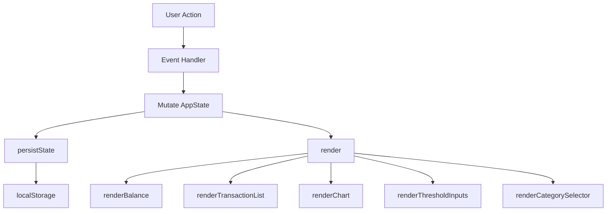

# Design Document: Expense & Budget Visualizer

## Overview

The Expense & Budget Visualizer is a zero-dependency, client-side single-page application delivered as three static files: `index.html`, `css/styles.css`, and `js/app.js`. It lets users record spending transactions, view a running total balance, browse a scrollable transaction history, and visualise category distribution via a Chart.js pie chart. All state is persisted in `localStorage`. No server, build step, or framework is required.

The optional features selected for implementation are:
- **Custom Categories** (Requirement 8)
- **Sort Transactions** (Requirement 10)
- **Spending Threshold Highlight** (Requirement 11)

These three were chosen because they add the most functional depth while remaining purely client-side and stateless.

The following optional features are **out of scope** for this implementation:
- Monthly Summary View (Requirement 9) — deferred; adds complexity without core value
- Dark/Light Mode Toggle (Requirement 12) — deferred; purely cosmetic, can be added later

---

## Architecture

The app follows a simple **unidirectional data flow** pattern without a framework:

```
User Interaction
      │
      ▼
  Event Handler (js/app.js)
      │
      ▼
  State Mutation (in-memory array + Storage write)
      │
      ▼
  render() — full re-render of affected UI regions
```

All mutable state lives in a single `AppState` object. Every user action calls a pure state-mutation function, persists to `localStorage`, then calls `render()` to synchronise the DOM. There is no two-way binding; the DOM is always derived from `AppState`.



---

## Components and Interfaces

### 1. AppState (in-memory model)

Central singleton holding all runtime state. Initialised from `localStorage` on page load.

```js
const AppState = {
  transactions: [],      // Transaction[]
  categories: [],        // string[]  (built-in + custom)
  thresholds: {},        // { [category]: number }
  sortKey: null,         // 'amount-asc' | 'amount-desc' | 'category-asc' | null  (not persisted)
};
```

### 2. Input Form Component

Renders inside `#form-section`. Handles:
- Field validation (name, positive amount, category)
- Inline error display
- Form reset on successful submission

Public interface (called by event listener):
```js
function handleFormSubmit(event) { ... }
function validateForm(name, amount, category): string[] { ... }  // returns error messages
```

### 3. Transaction List Component

Renders inside `#transaction-list`. Handles:
- Displaying each transaction row (name, amount, category, delete button)
- Threshold highlight class on over-budget rows
- Sort controls (amount asc/desc, category asc)

```js
function renderTransactionList(transactions, thresholds, categoryTotals) { ... }
function getSortedTransactions(transactions, sortKey): Transaction[] { ... }
```

### 4. Balance Display Component

Renders inside `#balance-display`. Simple sum of all transaction amounts.

```js
function renderBalance(transactions) { ... }
function calculateBalance(transactions): number { ... }
```

### 5. Chart Component

Renders a Chart.js `pie` chart inside `#chart-canvas`. Destroyed and re-created on each render to avoid Chart.js instance conflicts.

```js
function renderChart(transactions, thresholds) { ... }
function getCategoryTotals(transactions): { [category]: number } { ... }
```

### 6. Category Manager Component

Renders inside `#category-manager`. Handles:
- Displaying current custom categories
- Add-category form with duplicate detection (case-insensitive)
- Persisting custom categories

```js
function handleAddCategory(name) { ... }
function renderCategorySelector(categories) { ... }
```

### 7. Threshold Manager Component

Renders threshold inputs inside `#threshold-section`. One numeric input per category.

```js
function handleSetThreshold(category, value) { ... }
function renderThresholdInputs(categories, thresholds) { ... }
```

### 8. Storage Module

Thin wrapper around `localStorage` with JSON serialisation and error handling.

```js
function loadState(): Partial<AppState> | null { ... }
function saveState(state: AppState): void { ... }
```

---

## Data Models

### Transaction

```js
/**
 * @typedef {Object} Transaction
 * @property {string} id        - UUID v4 (crypto.randomUUID or fallback)
 * @property {string} name      - Item description (non-empty string)
 * @property {number} amount    - Positive number (stored as float, displayed to 2dp)
 * @property {string} category  - Category label (must exist in AppState.categories)
 * @property {string} date      - ISO 8601 date string (new Date().toISOString())
 */
```

### Persisted Storage Schema

The single `localStorage` key is `"ebv_state"`. Value is a JSON-serialised object:

```json
{
  "transactions": [ /* Transaction[] */ ],
  "categories": [ "Food", "Transport", "Fun", "Other" ],
  "thresholds": { "Food": 200, "Fun": 50 }
}
```

`sortKey` is intentionally not persisted — sort preference resets to default on reload.

### Built-in Categories

```js
const DEFAULT_CATEGORIES = ["Food", "Transport", "Fun", "Other"];
```

Custom categories are appended to this list and stored in `AppState.categories`.

---

---

## Visual Design & Theme Constraints
- **Palette:** Primary background `Beige (#F5F1EA)`, accents/cards `Pale Blue (#D6E8F2)`, text `Charcoal (#2C2F33)`.
- **Typography:** Strictly limited to **two (2) font families**: one serif/elegant for headings, one clean sans-serif for body/UI. Fallback stacks required.
- **Layout & Hierarchy:** Consistent border-radius (`8px–12px`), subtle shadows, adequate whitespace, and WCAG AA contrast ratios for all text/interactive elements.
- **NFR-1 Clarification:** `"No test setup required"` applies to the end-user runtime. `Vitest` + `jsdom` are strictly dev-time dependencies and will not ship in the final `js/app.js` or HTML/CSS deliverables.


## Correctness Properties

*A property is a characteristic or behavior that should hold true across all valid executions of a system — essentially, a formal statement about what the system should do. Properties serve as the bridge between human-readable specifications and machine-verifiable correctness guarantees.*


### Property 1: Valid Transaction Submission Round-Trip

*For any* valid transaction (non-empty name, positive amount, existing category), submitting the form should result in that transaction appearing in the transaction list and being retrievable from Storage with equivalent data.

**Validates: Requirements 1.2, 5.4**

### Property 2: Invalid Input Rejection

*For any* form submission where at least one field is empty, or where the amount is non-positive or non-numeric, the transaction list and Storage should remain unchanged after the attempted submission.

**Validates: Requirements 1.3, 1.4**

### Property 3: Form Reset After Successful Submission

*For any* valid transaction submission, all form fields should be empty/default immediately after the transaction is added.

**Validates: Requirements 1.5**

### Property 4: Transaction List Renders All Fields

*For any* transaction in the transaction list, the rendered HTML for that row should contain the transaction's item name, amount, and category.

**Validates: Requirements 2.1**

### Property 5: Delete Removes From List and Storage

*For any* transaction currently in the list, activating its delete control should result in that transaction being absent from both the in-memory list and the serialised Storage value.

**Validates: Requirements 2.4**

### Property 6: Balance Invariant

*For any* set of transactions (after any sequence of additions and deletions), the displayed balance should equal the arithmetic sum of all transaction amounts in the current list.

**Validates: Requirements 3.2, 3.3, 3.4**

### Property 7: Category Totals Invariant

*For any* set of transactions, the data passed to the Chart should equal the result of summing transaction amounts grouped by category — and this should hold after any addition, deletion, or page load.

**Validates: Requirements 4.1, 4.2, 4.3, 4.4**

### Property 8: Storage Serialisation Round-Trip

*For any* valid AppState (transactions, categories, thresholds), serialising it to JSON and then deserialising it should produce an equivalent AppState with no data loss or type coercion.

**Validates: Requirements 5.4**

### Property 9: Custom Category Addition

*For any* unique category name (not already present, case-insensitive), adding it via the Category Manager should result in it appearing in both `AppState.categories` and the Input Form's category selector.

**Validates: Requirements 8.1, 8.2**

### Property 10: Custom Category Persistence

*For any* set of custom categories added during a session, serialising and deserialising the state should restore all custom categories in the same order.

**Validates: Requirements 8.3**

### Property 11: Duplicate Category Rejection

*For any* category name that already exists in `AppState.categories` (compared case-insensitively), attempting to add it should leave the categories list unchanged.

**Validates: Requirements 8.4**

### Property 12: Sort Ordering Correctness

*For any* list of transactions and any valid sort key (amount-asc, amount-desc, category-asc), the result of `getSortedTransactions` should be a permutation of the original list that satisfies the corresponding ordering relation for all adjacent pairs.

**Validates: Requirements 10.1, 10.2**

### Property 13: Sort Does Not Mutate Storage

*For any* sort operation, the value stored in `localStorage` after sorting should be identical to the value before sorting — sort is a view-only transformation.

**Validates: Requirements 10.3**

### Property 14: Threshold Highlight Invariant

*For any* category whose total spend meets or exceeds its configured threshold, every transaction row belonging to that category should carry the over-budget CSS class, and the corresponding chart dataset entry should be marked as over-threshold.

**Validates: Requirements 11.2, 11.3**

### Property 15: Threshold Persistence

*For any* threshold map (category → numeric limit), serialising and deserialising the state should restore all threshold values exactly.

**Validates: Requirements 11.4**

---

## Error Handling

| Scenario | Handling |
|---|---|
| `localStorage` unavailable (private browsing, quota exceeded) | Catch the exception in `saveState`/`loadState`; initialise with empty state; show a non-blocking banner warning the user that data will not be saved. |
| `localStorage` contains malformed JSON | `JSON.parse` wrapped in try/catch; fall back to empty state; show warning banner. |
| `crypto.randomUUID` unavailable (old Safari) | Fallback: `Math.random().toString(36).slice(2) + Date.now()` for ID generation. |
| Chart.js CDN unavailable | Chart canvas shows a text fallback: "Chart unavailable — could not load Chart.js." |
| Amount field receives non-numeric input | Caught by `validateForm`; inline error shown; transaction not added. |
| Duplicate category name | Caught by `handleAddCategory` with case-insensitive check; inline error shown; category not added. |
| Threshold set to non-positive value | Input validated; error shown; threshold not saved. |

---

## Testing Strategy

### Dual Testing Approach

Both unit tests and property-based tests are required. They are complementary:
- Unit tests catch concrete bugs with specific known inputs and edge cases.
- Property-based tests verify universal correctness across the full input space.

### Technology Stack

- **Test runner**: [Vitest](https://vitest.dev/) (zero-config, ESM-native, runs in Node without a browser)
- **Property-based testing library**: [fast-check](https://fast-check.io/) (TypeScript-friendly, works with Vitest)
- **DOM testing**: `jsdom` environment (configured in Vitest) for components that touch the DOM

### Unit Tests

Focus on specific examples, edge cases, and integration points:

- `calculateBalance([])` returns `0`
- `calculateBalance` with a known set of transactions returns the correct sum
- `getCategoryTotals` with transactions across multiple categories returns correct per-category sums
- `validateForm` returns errors for each invalid input combination
- `getSortedTransactions` with a known list returns the expected order
- `loadState` returns `null` when `localStorage` is empty
- `loadState` returns `null` and does not throw when `localStorage` contains invalid JSON
- Chart placeholder is rendered when transaction list is empty (edge case 4.5)
- Storage unavailable warning is shown (edge case 5.5)

### Property-Based Tests

Each property test runs a minimum of **100 iterations**. Each test is tagged with a comment referencing the design property.

```
// Feature: expense-budget-visualizer, Property N: <property_text>
```

| Property | Test Description | Arbitraries |
|---|---|---|
| P1 | Valid transaction round-trip | `fc.record({ name: fc.string({minLength:1}), amount: fc.float({min:0.01}), category: fc.constantFrom(...DEFAULT_CATEGORIES) })` |
| P2 | Invalid input rejected | `fc.oneof(emptyNameArb, nonPositiveAmountArb, emptyAmountArb)` |
| P3 | Form reset after submission | Same as P1 |
| P4 | Transaction list renders all fields | `fc.array(transactionArb, {minLength:1})` |
| P5 | Delete removes from list and storage | `fc.array(transactionArb, {minLength:1})` + pick random index |
| P6 | Balance invariant | `fc.array(transactionArb)` — check `calculateBalance(txns) === txns.reduce((s,t) => s+t.amount, 0)` |
| P7 | Category totals invariant | `fc.array(transactionArb)` — check each category sum |
| P8 | Storage serialisation round-trip | `fc.record({ transactions: fc.array(transactionArb), categories: fc.array(fc.string()), thresholds: fc.dictionary(fc.string(), fc.float({min:0})) })` |
| P9 | Custom category addition | `fc.string({minLength:1})` not in existing categories |
| P10 | Custom category persistence | `fc.array(fc.string({minLength:1}), {minLength:1})` |
| P11 | Duplicate category rejection | `fc.constantFrom(...existingCategories)` with case variations |
| P12 | Sort ordering correctness | `fc.array(transactionArb, {minLength:2})` + `fc.constantFrom('amount-asc','amount-desc','category-asc')` |
| P13 | Sort does not mutate storage | Same as P12 — compare `localStorage` before and after |
| P14 | Threshold highlight invariant | `fc.array(transactionArb)` + `fc.dictionary(categoryArb, fc.float({min:0}))` |
| P15 | Threshold persistence | `fc.dictionary(categoryArb, fc.float({min:0.01}))` |

### Property Test Configuration

```js
// vitest.config.js
export default {
  test: {
    environment: 'jsdom',
  }
}
```

```js
// Example property test skeleton
import { describe, it } from 'vitest';
import fc from 'fast-check';
import { calculateBalance } from '../js/app.js';

describe('expense-budget-visualizer properties', () => {
  it('P6: balance invariant', () => {
    // Feature: expense-budget-visualizer, Property 6: Balance Invariant
    fc.assert(
      fc.property(fc.array(transactionArb), (txns) => {
        const expected = txns.reduce((s, t) => s + t.amount, 0);
        return Math.abs(calculateBalance(txns) - expected) < 0.001;
      }),
      { numRuns: 100 }
    );
  });
});
```
